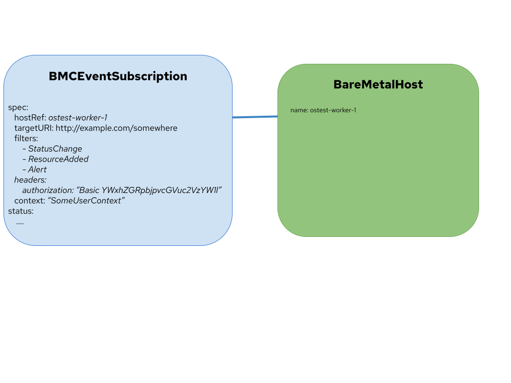

<!--
 This work is licensed under a Creative Commons Attribution 3.0
 Unported License.

 http://creativecommons.org/licenses/by/3.0/legalcode
-->

# Event Subscription API

Users of bare metal hardware may want to receive events from the
baseboard management controller (BMC) in order to act on them, such as
failed hardware, increases in temperature, and other reasons.

## Status

provisional

## Summary

The Redfish standard includes the ability to subscribe to events, which
will cause hardware events to be sent in a particular format to a target
URI. This design document describes a Metal3 API for configuring a
subscription. While Redfish is the primary target for this design, the
Ironic API is vendor-neutral and seeks to provide a unified interface
for configuring events.

## Motivation

Some environments run workloads that need to deal with potential
failures or environmental changes quicker than they would get an alert
from other kind of eventing software. For example, some workloads may
have a sidecar container that knows how to deal with an alert that a
particular network interface went down, or that the CPU temperature
reached a certain threshold.

### Goals

- Provide an API to manage subscriptions to events

### Non-Goals

- Any kind of event polling
- Software for processing the events, i.e. any webhook
- BMC's beyond Redfish for now

## Proposal

### User Stories

- As a user, I'd like to configure a my BMC to send events to a target URL.
- As a user, I'd like to filter the types of events the BMC sends to my target URL.
- As a user, I'd like to provide context to a particular event subscription.
- As a user, I'd like to provide arbitrary headers.

## Design Details

### Implementation Details

- A BMCEventSubscription resource represents a subscription to the events generated
  by a specific BMC.
- Ironic will manage configuring the subscription, using a new API for managing them.
- The BMCEventSubscription with maintain a reference to a BareMetalHost.
- The BMCEventSubscription must have a way to inject headers, to allow for tokens,
  basic auth, etc.

#### Open Questions

- We'll likely need a dedicated controller, I imagine BMO is the right place?
- What kind of RBAC do we need? States for this resource?
- We should allow for secrets to be used for header values, to protect tokens
  or basic auth information. What does that interface look like?

### Risks and Mitigations

Large numbers of events across large numbers of BareMetalHosts could
generate a lot of traffic, we provide users mitigation facilities by
allowing them to filter events to specific types.

### Dependencies

[Ironic Eventing API](https://storyboard.openstack.org/#!/story/2008366)
needs to be complete.

### Test Plan

There are some existing POC code for working with Redfish Events, we
could build on this to implement a test framework for BMC events. We could
also consider modifying sushy-tools to support emulated eventing.

### Upgrade / Downgrade Strategy

Not required

## References

- [Ironic Eventing API](https://storyboard.openstack.org/#!/story/2008366)
- [DMTF: Redfish Eventing](https://www.dmtf.org/sites/default/files/Redfish%20School%20-%20Events.pdf)
- [Redfish Event Controller (POC)](https://github.com/dhellmann/redfish-event-controller)
- [Redfish Event Experiment (POC)](https://github.com/dhellmann/redfish-event-experiment)
